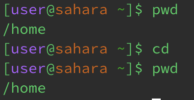
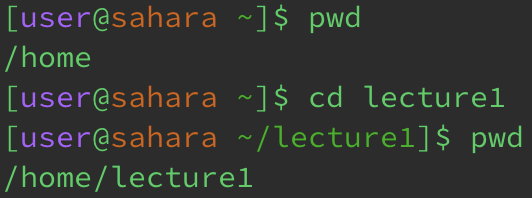
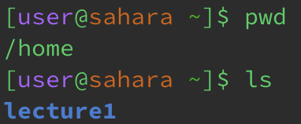
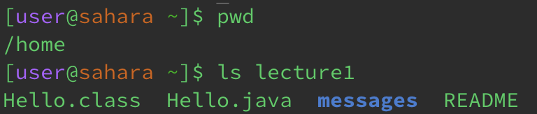
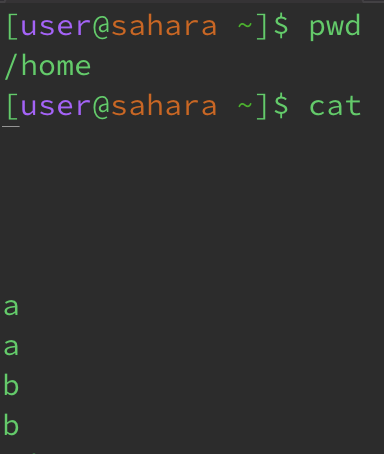
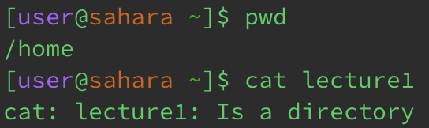
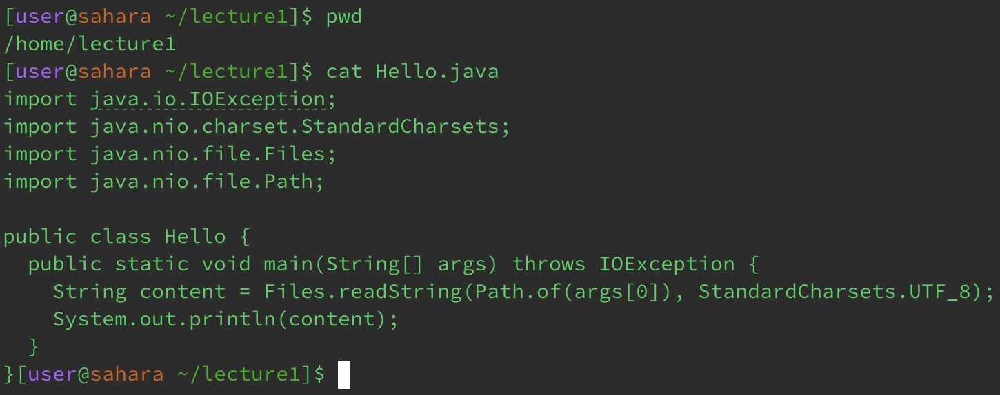

# Using `cd`

I got this output because I did not pass any arguments to the `cd` command. When the command was run, the current working directory was the `home` directory. Since I didn’t tell the terminal to change to a particular directory, the working directory stayed as the `home` directory after I ran the `cd` command.
This is not an error.

I got this output because I provided a directory name to the `cd` command. When the command was run, the current working directory was the `home` directory. I then provided `lecture1` as an argument to the `cd` command, which changed the working directory from `home` to `lecture1`. Using the `pwd` command after running `cd lecture1` correctly shows that the working directory is now `lecture1`.
This is not an error.

I got this output because I passed a file name to the `cd` command. When the command was run, the current working directory was the `lecture1` directory and thus `Hello.java` was accessible. When running the `cd` command, I provided `Hello.java` as an argument to it. Since `Hello.java` is a file and not a directory, the terminal doesn’t know what directory to change to even though an argument was passed in.
This is an error. It displays a specific message saying that `Hello.java` isn’t a directory, and therefore it isn’t a valid argument for the `cd` command.

# Using `ls`

I got this output because I did not provide any arguments to the `ls` command. The current working directory was the `home` directory at the time of running the `ls` command. Using the `ls` command on its own just lists all of the files and folders in the current working directory. In this case, the only file/folder in the `home` directory was `lecture1`.
This is not an error.

I got this output because I passed in a directory name to the `ls` command. The current working directory at the time was the `home` directory, but in this case, that doesn't matter since I passed in a specific directory name. Using the `ls` command with a directory name will list all of the files and folders in that directory.
This is not an error.

I got this output because I passed in a file name to the `ls` command. The current working directory in this example was the `lecture1` directory, but that wasn't pertinent since I provided a specific file name (`Hello.java` in this case). Since there is only one file in a file, using `ls` with a file name will just list the file that I typed in.
This is not an error.

# Using `cat`

I got this output because I did not provide any arguments to the `cat` command. The current working directory in this example was the `home` directory, but the computer wasn't trying to access any specific files so this particular example didn't really rely on what directory I was in. Without arguments, the `cat` command seems to just copy what the user types into the terminal next.
This is not an error.

I got this output because I provided a directory name to the `cat` command instead of a file name. The current working directory for this example was the `home` directory, which was important since the `lecture1` directory I passed to the `cat` command was in the `home` directory. Even though I was in the right directory to access `lecture1`, the `cat` command only works with files.
This is an error. It displays a specific message saying that `lecture1` is a directory, which means that it can’t be used with the `cat` command.

I got this output because I provided a file name to the `cat` command. The current working directory for this example was the `lecture1` directory, which was located in the `home` directory. Being in the `lecture1` directory instead of just the `home` directory was important because I would not be able to access `Hello.java` if I was just in the `home` directory. Since I was in the `lecture1` directory **and** only passed one file name (`Hello.java`) to the terminal, it printed the contents of `Hello.java` only. If you pass one file name to the `cat` command, it just outputs the contents of that file as text in the terminal.
This is not an error.
