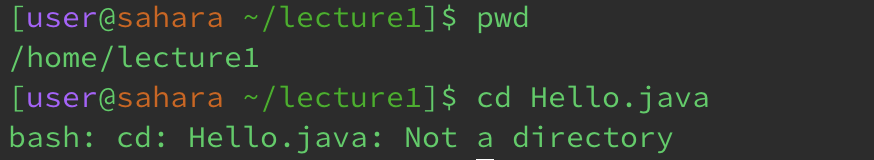

# Using `cd`

I got this output because I did not pass any arguments to the `cd` command. Since I didn’t tell the terminal to change to a particular directory, the working directory didn’t change after I ran the `cd` command.
This is not an error.

I got this output because I provided a directory name to the `cd` command. Using the `pwd` command after running `cd lecture1` correctly shows that the working directory is now `lecture1`.
This is not an error.

I got this output because I passed a file name to the `cd` command. Since `Hello.java` is a file and not a directory, the terminal doesn’t know what directory to change to even though an argument was passed in.
This is an error. It displays a specific message saying that `Hello.java` isn’t a directory, and therefore it isn’t a valid argument for the `cd` command.

# Using `ls`

I got this output because I did not provide any arguments to the `ls` command. Using the `ls` command on its own just lists all of the files and folders in the current directory.
This is not an error.

I got this output because I passed in a directory name to the `ls` command. Using the `ls` command with a directory name will list all of the files and folders in that directory.
This is not an error.

I got this output because I passed in a file name to the `ls` command. Since there is only one file in a file, using `ls` with a file name will just list the file that I typed in.
This is not an error.

# Using `cat`

I got this output because I did not provide any arguments to the `cat` command. Without arguments, the `cat` command seems to just copy what the user types into the terminal next.
This is not an error.

I got this output because I provided a directory name to the `cat` command instead of a file name. The `cat` command only works with files.
This is an error. It displays a specific message saying that `lecture1` is a directory, which means that it can’t be used with the `cat` command.

I got this output because I provided a file name to the `cat` command. If you pass one file name to the `cat` command, it just outputs the contents of that file as text in the terminal.
This is not an error.
