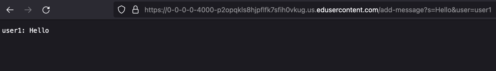
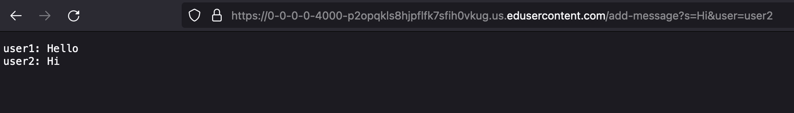
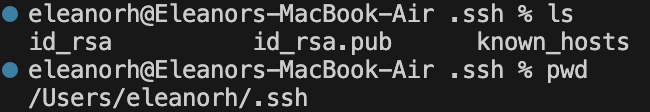
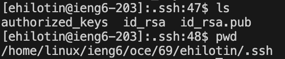
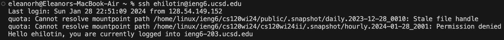

# Part 1 - `ChatServer`
## `ChatServer` Code
```
import java.io.IOException;
import java.net.URI;

class Handler implements URLHandler {
    // The one bit of state on the server: a number that will be manipulated by
    // various requests.
    String chatLog = "";

    public String handleRequest(URI url) {
        if (url.getPath().equals("/")) {
            return chatLog;
        } 
        else if (url.getPath().equals("/add-message")) {
            String[] parameters = url.getQuery().split("&");
            String msg = "";
            String usr = "";
            if(parameters[0].contains("s=")){
                String[] message = parameters[0].split("=");
                msg = message[1];
            }

            if(parameters[1].contains("user=")){
                String[] user = parameters[1].split("=");
                usr = user[1];
            }
            
            chatLog = chatLog + String.format("%s: %s \n", usr, msg);
            return chatLog;
        } 
        else {
            return "404 Not Found!";
        }
    }
}

class ChatServer {
    public static void main(String[] args) throws IOException {
        if(args.length == 0){
            System.out.println("Missing port number! Try any number between 1024 to 49151");
            return;
        }

        int port = Integer.parseInt(args[0]);

        Server.start(port, new Handler());
    }
}
```
## Screenshots

The only method that is called is the `handleRequest` method. The main method isn't called in this screenshot since it just starts the server. However, the main method is running (and thus was called previously) at the time of this screenshot since the server is live.

The relevant (and only) argument passed into `handleRequest` is `URI url`, which is the URL of the server.

There are six fields that are relevant specifically to the `ChatServer`'s purpose. Five of these fields are local to the `handleRequest` method, which means their values are deleted at the termination of the `handleRequest` method.

Before this specific request:
1. `String chatLog` had a value of `""`.
2. `String[] parameter` had a value of `{}`.
3. `String msg` had a value of `""`.
4. `String usr` had a value of `""`.
5. `String[] message` had a value of `{}`.
6. `String[] user` had a value of `{}`.

From this specific request:
1. `String chatLog` now has a value of `"user1: Hello \n"`. This value changed from `""` as a result of the `handleRequest` method.
2. `String[] parameter` has a value of `{"Hello", "user1"}` while the request is being carried out. The value gets erased at `handleRequest`'s termination, so the final value is the same as it was before this request (`{}`).
3. `String msg` has a value of `"Hello"` while the request is being carried out. The value gets erased at `handleRequest`'s termination, so the final value is the same as it was before this request (`""`).
4. `String usr` has a value of `"user1"` while the request is being carried out. The value gets erased at `handleRequest`'s termination, so the final value is the same as it was before this request (`""`).
5. `String[] message` has a value of `{"s", "Hello"}` while the request is being carried out. The value gets erased at `handleRequest`'s termination, so the final value is the same as it was before this request (`{}`).
6. `String[] user` has a value of `{"user", "user1"}` while the request is being carried out. The value gets erased at `handleRequest`'s termination, so the final value is the same as it was before this request (`{}`).


The only method that is called is the `handleRequest` method.

The relevant argument passed into `handleRequest` is `URI url`, which is the URL of the server.

There are six fields that are relevant specifically to the `ChatServer`'s purpose. Five of these fields are local to the `handleRequest` method, which means their values are deleted at the termination of the `handleRequest` method.

Before this specific request:
1. `String chatLog` had a value of `"user1: Hello \n"`.
2. `String[] parameter` had a value of `{}`.
3. `String msg` had a value of `""`.
4. `String usr` had a value of `""`.
5. `String[] message` had a value of `{}`.
6. `String[] user` had a value of `{}`.

From this specific request:
1. `String chatLog` now has a value of `"user1: Hello \n user2: Hi \n"`. This value changed from `"user1: Hello \n"` as a result of the `handleRequest` method.
2. `String[] parameter` has a value of `{"Hi", "user2"}` while the request is being carried out. The value gets erased at `handleRequest`'s termination, so the final value is the same as it was before this request (`{}`).
3. `String msg` has a value of `"Hi"` while the request is being carried out. The value gets erased at `handleRequest`'s termination, so the final value is the same as it was before this request (`""`).
4. `String usr` has a value of `"user2"` while the request is being carried out. The value gets erased at `handleRequest`'s termination, so the final value is the same as it was before this request (`""`).
5. `String[] message` has a value of `{"s", "Hi"}` while the request is being carried out. The value gets erased at `handleRequest`'s termination, so the final value is the same as it was before this request (`{}`).
6. `String[] user` has a value of `{"user", "user2"}` while the request is being carried out. The value gets erased at `handleRequest`'s termination, so the final value is the same as it was before this request (`{}`).

# Part 2 - `ssh`
## Private Path


## Public Path


## Using the Key


# Part 3 - What I've Learned (Weeks 2 & 3)
In lab during weeks 2 and 3, I've learned about the different parts of a URL and how the server handles them. Before this lab, I could sometimes guess what parts of a URL meant, but I never understood how the server knew what to do with them. Building simple programs like the `SearchEngine` from week 2 and the `ChatServer` from week 3 made URLs and servers a lot more understandable.
