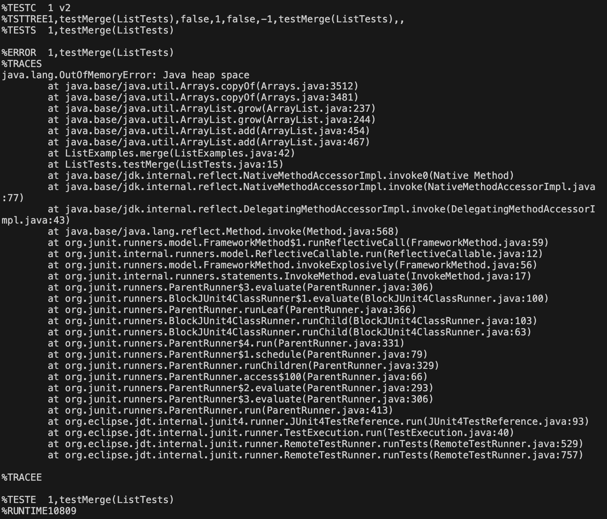

# Part 1 - Bugs
## The Original Code
```
  static List<String> merge(List<String> list1, List<String> list2) {
    List<String> result = new ArrayList<>();
    int index1 = 0, index2 = 0;
    while(index1 < list1.size() && index2 < list2.size()) {
      if(list1.get(index1).compareTo(list2.get(index2)) < 0) {
        result.add(list1.get(index1));
        index1 += 1;
      }
      else {
        result.add(list2.get(index2));
        index2 += 1;
      }
    }
    while(index1 < list1.size()) {
      result.add(list1.get(index1));
      index1 += 1;
    }
    while(index2 < list2.size()) {
      result.add(list2.get(index2));
      index1 += 1;
    }
    return result;
  }
```
## Failure-Inducing Input
```
    @Test
    public void testMerge(){
        List<String> list1 = new ArrayList<String>(); 
        List<String> list2 = new ArrayList<String>();
        list1.add("a");
        list1.add("c");
        list2.add("b");
        list2.add("d");
        List mergedList = ListExamples.merge(list1, list2);
        assertEquals("a", mergedList.get(0));
    }
```

## Successful Input
```
    @Test
    public void testMergeSucceed(){
        List<String> list1 = new ArrayList<String>(); 
        List<String> list2 = new ArrayList<String>();
        list1.add("a");
        list1.add("c");
        list2.add("b");
        List mergedList = ListExamples.merge(list1, list2);
        assertEquals("b", mergedList.get(1));
    }
```

## Changes
```
// This is the buggy section before changes
while(index2 < list2.size()) {
      result.add(list2.get(index2));
      index1 += 1;
    }
```
```
// This is the buggy section after changes
while(index2 < list2.size()) {
      result.add(list2.get(index2));
      index2 += 1; // variable updated is now index2 instead of index1
    }
```
This change fixes the issue because before, `index2` would always be less than `list2.size()`, and therefore the `while` loop would never end. With the changes, `index2` is now being updated properly, and the `while` loop now has a way to end.

# Part 2 - Researching Commands
