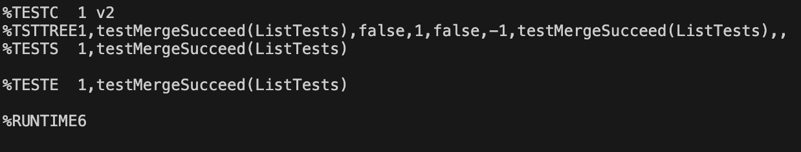

# Part 1 - Bugs
## The Original Code
```
  static List<String> merge(List<String> list1, List<String> list2) {
    List<String> result = new ArrayList<>();
    int index1 = 0, index2 = 0;
    while(index1 < list1.size() && index2 < list2.size()) {
      if(list1.get(index1).compareTo(list2.get(index2)) < 0) {
        result.add(list1.get(index1));
        index1 += 1;
      }
      else {
        result.add(list2.get(index2));
        index2 += 1;
      }
    }
    while(index1 < list1.size()) {
      result.add(list1.get(index1));
      index1 += 1;
    }
    while(index2 < list2.size()) {
      result.add(list2.get(index2));
      index1 += 1;
    }
    return result;
  }
```
## Failure-Inducing Input
```
    @Test
    public void testMerge(){
        List<String> list1 = new ArrayList<String>(); 
        List<String> list2 = new ArrayList<String>();
        list1.add("a");
        list1.add("c");
        list2.add("b");
        list2.add("d");
        List mergedList = ListExamples.merge(list1, list2);
        assertEquals("a", mergedList.get(0));
    }
```

## Successful Input
```
    @Test
    public void testMergeSucceed(){
        List<String> list1 = new ArrayList<String>(); 
        List<String> list2 = new ArrayList<String>();
        list1.add("a");
        list1.add("c");
        list2.add("b");
        List mergedList = ListExamples.merge(list1, list2);
        assertEquals("b", mergedList.get(1));
    }
```

## Changes
```
// This is the buggy section before changes
while(index2 < list2.size()) {
      result.add(list2.get(index2));
      index1 += 1;
    }
```
```
// This is the buggy section after changes
while(index2 < list2.size()) {
      result.add(list2.get(index2));
      index2 += 1; // variable updated is now index2 instead of index1
    }
```
This change fixes the issue because before, `index2` would always be less than `list2.size()`, and therefore the `while` loop would never end. With the changes, `index2` is now being updated properly, and the `while` loop now has a way to end.

# Part 2 - Researching Commands
I chose to research the `grep` command.
For all examples, I only used [this](https://man7.org/linux/man-pages/man1/grep.1.html) page.
## `-e`
**Example One**
```
// the commands
find technical/biomed > lr-files.txt
grep -e "1468" lr-files.txt > e-results-one.txt
```
```
// the final output
technical/biomed/1468-6708-3-10.txt
technical/biomed/1468-6708-3-4.txt
technical/biomed/1468-6708-3-7.txt
technical/biomed/1468-6708-3-3.txt
technical/biomed/1468-6708-3-1.txt

```

In this block of commands, the system first searches for all of the files in the `biomed` directory, then it finds all of the files that have `"1468"` in the title and puts them in the `e-results-one.txt` file. This kind of usage might be useful if you are searching for files in a directory that is sorted by date, and you are looking for files from a specific date.

**Example Two**
```
// the commands
cat technical/biomed/gb-2002-4-1-r1.txt > cat-one.txt
grep -e "genome" cat-one.txt > e-results-two.txt
```
```
// the final output
        In May 2002, two new mouse genome assemblies were
        released. One was the second version of the mouse genome
       ... note 47 lines ommitted ...
        of one chromosome in the whole genome are available as
        of one chromosome in the whole genome

```
In this block of commands, the system concatenates the contents of a file (in this case `technical/biomed/gb-2002-4-1-r1.txt`) into a new file, then it looks for all instances of the word `"genome"` in the file. This may be useful if you are looking for specific information in a large text file.

## `-i`
**Example One**
```
// the command
grep -e "genome" cat-one.txt -i > i-results-one.txt
```
```
// the final output
        In May 2002, two new mouse genome assemblies were
        released. One was the second version of the mouse genome
        ... note 49 lines omitted ...
        of one chromosome in the whole genome are available as
        of one chromosome in the whole genome

```

With this command option, the system looks for all instances of the word `"genome"` in the `cat-one.txt` file without case-sensitivity. This is useful for finding all instances of a certain word in a file that may have varied capitalization of that word.

**Example Two**
```
// the command
grep -e "BioMed" lr-files.txt -i > i-results-two.txt
```
```
// the final output
technical/biomed
technical/biomed/1472-6807-2-2.txt
... note 834 lines omitted ...
technical/biomed/1472-684X-1-5.txt
technical/biomed/1476-4598-1-6.txt

```

This example better showcases how the `-i` command option finds all instances of a word without caring about capitalization. This may be handy if you have multiple files or folders named the same thing but with different capitalization, but you want to find all instances of that word in the file or folder titles.

## `-v`
**Example One**
```
// the command
grep -e "genome" cat-one.txt -v > v-results-one.txt
```
```
// the final output

  
    
      
        Background
        assembly from Celera Genomics, created by using both
        ... note 496 lines omitted ...
        correlation between portions of CSEs and chromosome length
        Click here for additional data file
      
    
  

```

This example shows how the `-v` option can be used to omit all (case-sensitive) instances of a word from the file that `grep` generates. This command option would be useful in omitting unnecessary information from certain documents.

**Example Two**
```
// the command
grep -e "14" lr-files.txt -v > v-results-two.txt
```
```
// the final output
technical/biomed
technical/biomed/gb-2002-4-1-r2.txt
... note 201 lines omitted ...
technical/biomed/bcr567.txt
technical/biomed/gb-2002-3-10-research0055.txt

```

This example shows how the `-v` command option can be useful when looking at file systems. This option could be handy when looking for files in a directory with lots of files named the same thing. By using the `-v` command, you can sort through the clutter of the other files to find the file you are looking for (granted the title of the file is fairly unique to the other files in the directory).

## `-w`
**Example One**
```
// the command
grep -e "genome" cat-one.txt -w > w-results-one.txt
```
```
// the final output
        In May 2002, two new mouse genome assemblies were
        released. One was the second version of the mouse genome
        ... note 37 lines omitted ...
        of one chromosome in the whole genome are available as
        of one chromosome in the whole genome

```

In this example, the `-w` option makes it so the new file contains lines that strictly have the given regular expression. This is different from using `-e` without `-w` because without `-w`, the file contains all instances of the regex and words containing the regex. This may be useful in cases where you're looking for lines that have a specific word in a file where there are many variations on the same word.

**Example Two**
```
// the command
grep -e "4" cat-one.txt -w > w-results-two.txt
```
```
// the final output
        gaps in these chromosomes occupy 4.1% of genome in Cel2 and
        4.5% in MGSCv3. The average size of the contigs, gaps and
          for Biotechnology Information (NCBI) ([ 4], 12 April,
          (11% in chromosome 18), AC023789 (85% in chromosome 4),
            whole chromosome (Figure 4), except one region around
          an 80-CPU LINUX cluster in 4 days. NCBI BLAST was used
          1.0e-4, and 1.0e-1) in this project. We found that 1.0e-1

```

This example shows how the `-w` option is useful for finding specific numbers. Without the option, the file would contain all instances of the number 4, including numbers like 40000 or 400. This may be useful for finding particular numbers or percentages in a long report.
