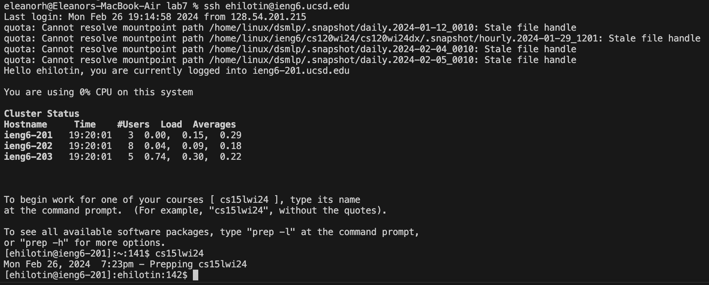
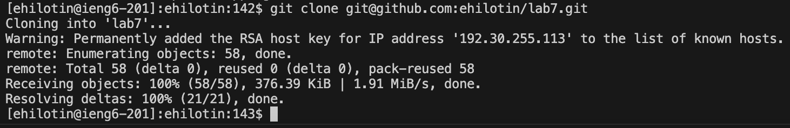
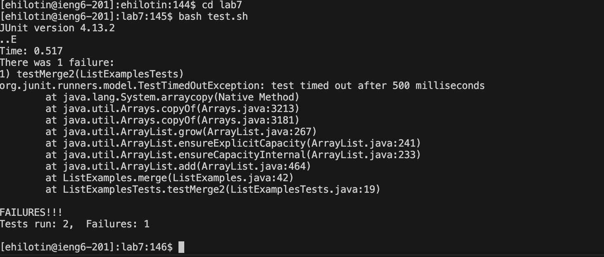
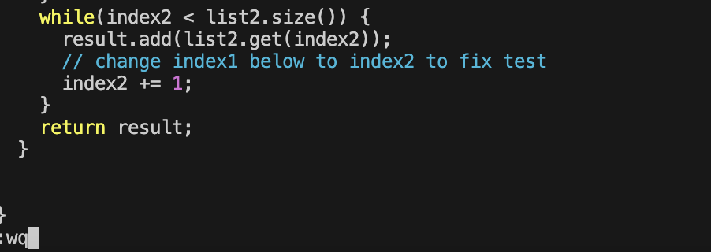
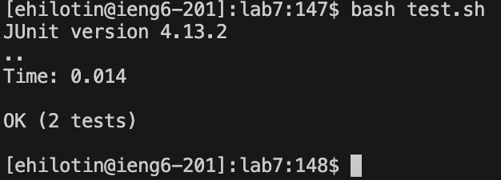
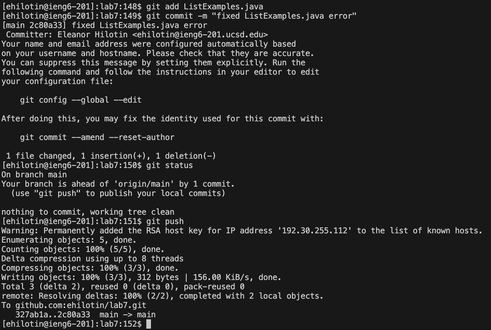

# Lab Report 4 - Vim

## Step 1

Keys pressed: `<up>`, `<enter>`, `cs15lwi24`, `<enter>`

The login in command was first in my command history, so I used the up arrow to reach it and run it. I then typed and ran the proper command (`cs15lwi24`) to get to the right part of the `ieng6` server for this class.

## Step 2

Keys pressed: `git clone <Command+V>`, `<enter>`

I had the `ssh` URL in my clipboard, so I typed the `git clone` command and pasted the `ssh` URL. I then ran the `git clone` command with the `ssh` URL.

## Step 3

Keys pressed: `cd lab7`, `<enter>`, `bash test.sh`, `<enter>`

I typed and ran the `cd` command to get to the right directory, then I did the same with the `bash` command to run the tests for `ListExamples.java` to show that they failed.

## Step 4

Keys pressed: `vim ListExamples.java`, `<enter>`, `<CAPSLOCK>`, `g`, `<CAPSLOCK>`, `6k`, `11l`, `r2`, `:wq`, `<enter>`

I typed and ran the proper `vim` command to access `ListExamples.java`. Then the following commands were used in the `vim` editor to correct the error in `ListExamples.java` and save the correction.

## Step 5

Keys pressed: `<up>`, `<up>`, `<enter>`

The `bash test.sh` command was 2 up in my command history, so I pressed the up arrow twice to access it then pressed `<enter>` to run it and show that the tests now succeed.

## Step 6

Keys pressed: `git add ListExamples.java`, `<enter>`, `git commit -m "fixed ListExamples.java error"`, `<enter>`, `git status`, `<enter>`, `git push`, `<enter>`

I typed and ran the `git add` to add `ListExamples.java` to the files that would be committed to the `lab7` repository on github. Then I committed the file with the `git commit` command and added a descriptive commit message. After that, I used the `git status` command to make sure that no other files needed to be committed, then I typed and ran the `git push` command to push my commit to the `main` branch.
