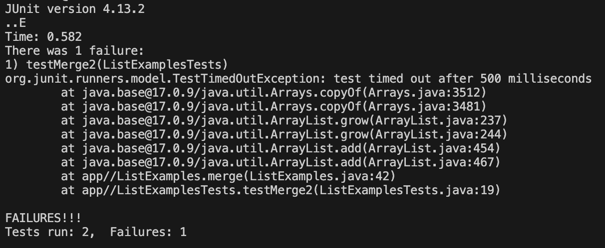

# Part 1 - Debugging Scenario

## The Student's Original Post


**student123:**
> Hi. I’m not sure why this test is failing. It seems like maybe a loop is running too many times? But when I look at my code, I’m not sure what’s wrong with it.

## A TA's (Possible) Response
**ta001:**
> Hi there! It's hard to know exactly what's going on in your program with just this symptom. Your test details seem to show that your program's current runtime is not what you expected, so your guess at the bug may be correct. Can you think of any tools we’ve used in class that can help you figure out where your program has unexpected behavior?

## The Student's Second Take

## All Things Setup
**File & Directory Structure**
```
labreport5/
|- lab7/
  |- lib/
    |- hamcrest-core-1.3.jar
    |- junit-4.13.2.jar
  |- ListExamples.java
  |- ListExamplesTests.java
  |- test.sh
  |- ListExamples.class
  |- ListExamplesTests.class
  |- StringChecker.class
```
**File Contents**

**ListExamples.java**
**ListExamplesTests.java**
**test.sh**

**Commands Run**

**Edits Made**

# Part 2 - Reflection
In the second half of the quarter, I was most interested by learning how to create bash scripts. I didn't know anything about scripting before this class, and now I think that scripting is a really efficient (and sometimes even fun) way to run programs. Learning about bash scripting really opened my eyes to a new world of possibilities in which I wouldn't have to type tons of commands just to achieve the same result as one script. Scripting will probably be my biggest takeaway from the second half of this class.
